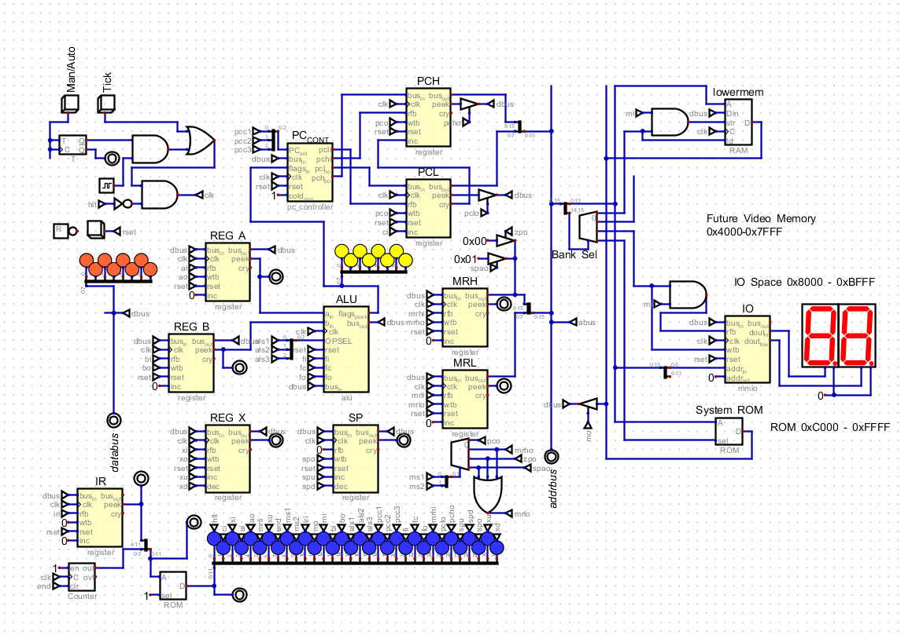

# GR 8bit Computer

This is an 8 bit computer implemented with [Digital](https://github.com/hneemann/Digital)
The assembler and microcode generator require python

## Files
* gr8bit_main.dig - Main file
* *.dig - supporting digital files
* assembler.py - assembler
* microcode_writer.py - generates miucrocode for CPU's sequencer
* opcodes.py - defines all the opcodes and microcode for the system
* *.hex various rom's needed for the system

## TODO

* verify X reg operations and indexed memory
* Hook up a terminal (keyboard/mouse)
* Get wozmon ported over
* get remaining ALU (bit/logic) ops working

* get a 'basic' working
* hook up some 'graphical display'
